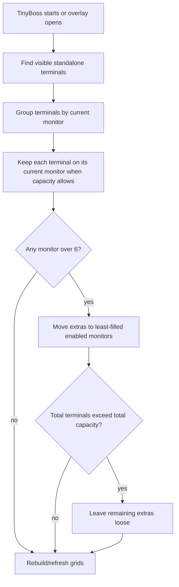

# Terminal Auto-Collect and Spillover Rebalance

## Problem Frame
TinyBoss should rebuild a useful terminal workspace when it starts or when a grid overlay is invoked. After a reboot, restart, or state drop, standalone terminal windows may still be visible but no longer attached to TinyBoss grids. The desired behavior is for TinyBoss to collect visible terminal windows, prefer the screens they are already on, and spill excess terminals to other enabled monitors only when a screen has more than its six-window capacity.

## User Flow

## Requirements

**Invocation**
- R1. TinyBoss must run terminal collection when the app starts.
- R2. TinyBoss must also run terminal collection when any TinyBoss overlay is invoked for an enabled monitor.
- R3. Collection must only include visible standalone terminal windows TinyBoss can detect; non-terminal windows and unsupported embedded terminals remain out of scope.
- R3a. Terminals on disabled monitors must remain loose and must not be used as spillover destinations.

**Monitor Preference and Capacity**
- R4. Each detected terminal must prefer the monitor it is already on.
- R5. Each enabled monitor can contain at most six TinyBoss-managed terminal windows.
- R6. When a monitor has six or fewer detected terminals, TinyBoss should keep those terminals on that monitor and rebuild that monitor's grid from them.
- R7. When a monitor has more than six detected terminals, TinyBoss must keep up to six there and treat the rest as overflow.

**Spillover**
- R8. Overflow terminals must be assigned to the least-filled enabled monitor with available capacity.
- R9. Spillover must consider terminals already present on recipient monitors, so a monitor with one or two terminals can receive overflow until it reaches six.
- R10. If multiple recipient monitors are equally least-filled, TinyBoss should use a stable deterministic order so repeated collection does not randomly reshuffle windows.
- R11. If total visible terminal count exceeds total enabled-monitor capacity, any remaining overflow terminals must stay loose and unmanaged.

**State and Aliases**
- R12. Recollection must preserve TinyBoss aliases for live windows whenever an alias is already known.
- R13. Recollection must repair dropped grid state by reattaching live terminal windows that are still visible on enabled monitors.
- R14. Recollection must not overwrite the real OS/window title of terminal windows.

**User Experience**
- R15. Collection should avoid unnecessary reshuffling: terminals that are already on a monitor with capacity should not move just because another overlay was opened.
- R16. Collection should be safe to run repeatedly; invoking overlays multiple times should converge to the same layout unless windows or monitors changed.

## Success Criteria
- Starting TinyBoss with terminals visible across three enabled monitors rebuilds grids on those monitors without assuming monitor 1 is special.
- With 8 terminals visible on one monitor and 1 terminal on another, TinyBoss keeps 6 on the first monitor and spills 2 to the least-filled monitor.
- With 19 visible terminals on three enabled monitors, TinyBoss manages 18 total and leaves 1 loose.
- Opening an overlay on any enabled monitor refreshes/recollects terminal grid state without moving terminals that already fit on their current monitor.
- Existing TinyBoss aliases remain visible in TinyBoss UI after recollection, but terminal window titles are not changed.

## Scope Boundaries
- No support for VS Code integrated terminals or other embedded terminal panes that do not expose a distinct terminal HWND.
- No attempt to manage more than six terminal windows per monitor.
- No hidden/minimized terminal collection in this feature; collection is based on visible standalone windows.
- No collection or spillover onto monitors disabled in TinyBoss settings.
- No persistent relaunch matching for aliases beyond live-window identity already supported by TinyBoss.

## Key Decisions
- **Current-monitor preference first:** The user's mental model is spatial; terminals should stay where they already are unless that monitor is over capacity.
- **Least-filled spillover:** Overflow should balance across available screens rather than defaulting to monitor 1 or a fixed destination.
- **Loose overflow beyond capacity:** When total windows exceed grid capacity, TinyBoss should leave extras alone instead of forcing unsupported layouts.

## Dependencies / Assumptions
- TinyBoss can enumerate enabled monitors and detect visible standalone terminal windows with the existing terminal detection limits.
- Monitor capacity is six because TinyBoss currently supports one-, two-, four-, and six-pane layouts.

## Outstanding Questions

### Resolve Before Planning
- None.

### Deferred to Planning
- [Affects R10][Technical] Define the stable deterministic monitor tie-break order using existing monitor enumeration behavior.
- [Affects R6-R8][Technical] Decide which six terminals stay on an overfull monitor: current spatial order, current grid order when known, or foreground/recent order if available.

## Next Steps
→ /ce-plan for structured implementation planning
